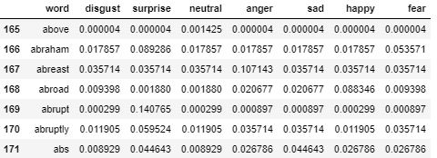

# Aim
To send double encrypted messages and key from one device to another and classify them based on their emotions. Following block diagram shows the workflow of the project:

❮img src="Images/Block_dig.JPG" width="900" ❯

# Procedure
## Generating Private/Public keys and encryption
The Private key is generated using `RSA.generate(length, Random.new().read)`, where length decides the length maximum possible length of Message that we need to send. And the public key is generated by `private_key.publickey()`. So by now, it’s clear that we are using the RSA encryption algorithm. Let's take a look at how this works.

This encryption and decryption process is done by the maths employed in the algorithm.

## Numeric Encryption
Since we plan to send key and encrypted messages through firebase. It's an easy task for hackers to retrieve the original message. And hence, we use numeric encryption. This is done by assigning random unique numbers to each character and number (basically everything present on the keyboard). This information is stored in a list format and needs to be shared with the receiver much prior to sending the message. So when the receiver receives the message and key, he/she will first decrypt them using the list and then decrypt the message using the key.
Note- Despite safe encryption processes, its possible many times to retrieve the original message by trying out millions of available keys. And hence numeric encryption is necessary to assure safety.

## Sending data to Firebase
After completing the encrypting process, numeric encrypted key and dual encrypted messages are sent to the firebase realtime database

## Retrieving data and decryption
The data is extracted from the firebase. After which key is and messages are decrypted numerically using the list. Further, the encrypted messages are decrypted to original messages using the key.

## Finding emotion of each message

The above dataset is a part of the full version of "Emotion Sensor Dataset" given by Jon Bill.

To know more about the dataset visit https://www.kaggle.com/iwilldoit/emotions-sensor-data-set
This dataset contains Top 23730 English Words along with their probabilities for & different classes(emotions) that contribute to the emotion of a sentence. By using this data set we can know the emotion of the sentence/message.

# Applications 
- Training chatbots to learn emotions and chat securely.
Most of our interactions with bots are transactional in nature. Order me a pizza. Tell me today’s weather. Remind me to buy flowers for Mom. But a growing breed of chatbots are being designed to do something far more impactful: "make us feel better". And guess if the bot is able to know your emotion through your securely transmitted message, sounds good right? 
- Classification of people in your friend list based on the set of emotions the frequently exhibit with you during the secured chat. Or answering just good and neutral emotion messages on a stressful day.
- Keeping track of emotions of a mentally ill based on their messages by the doctor.

# Conclusion
Our emotions can be a result of our past and present conditions and can be analyzed based on our text messages, privacy being the right can be compromised if text messages are used in a wrong way.
